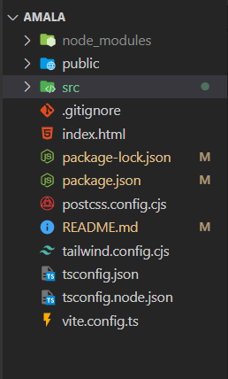
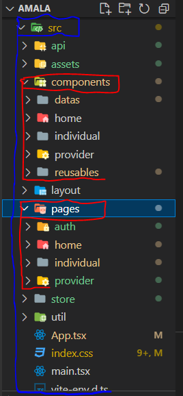

# amala.cloud
Amala.cloud is created with Vite+React+Typescript, it uses Tailwind CSS for styling, the default font is Helvetica World.

## Clone & Install Amala Application
* Clone the repository
```javascript
git clone https://github.com/PID-Amala/amala.cloud
```
* Change directory into the the project folder
```javascript
cd amala.cloud
```
* Install all the dependency
```javascript
npm install 
```
* You can go ahead to make changes to the main branch or checkout to your own branch before making changes.
```javascript
git checkout -b new_branch
```
* Start up the react application 
```react
npm run dev
```
* Copy and paste the the hosted local port from your terminal (e.g http://localhost:5173/) to your browser to view the home page.

## File Structure
Just like every other react app we have the node_modules, Public, and the src folders but the src folder is where all the works are been done. Hence, here is how the src folder is been structured.  
Aside from the three folders in the amala.cloud directory we also have these files as seen in the image bellow.
.

## The src folder
The src folder contains the following folders.  

.
### 1. api
The api folder is where we define our base api url in the authApi.ts file and the type definition in the types.ts file.
### 2. assets
We have three major folder here fonts for all variation of the Helvetica World font, icons for all out icons in .svg format, and images the contains all our application images. The fourth folder(mdImages) contains images that are used in this md file, so we don't need them in our application. 
### 3. components
The component folder contails all reusable component. 
 - The datas folder contain reusable datas. 
 - The home folder contain reusable components peculiar to the home page
 - The individual component contain reusable components peculiar to the individual pages/dashboard.
 - The provider folder contain reusable component peculiar to the provider pages/dashboard
 - The reusable component contain components that are reusables across the entire application. Components like button, form input etc.
### 4. layout
### 5. pages
This contain all the pages in the application and are divided into three parts
- auth - contains the the general authenticstion pages
- home - contains the home page, and other general pages like the not found pages and the terms and condition page.
- individual - is divided in the two, the auth for individual authentication pages and the dashboard for individual dashboard pages. The index.tsx file is for individual routing(Navigation)
- provider - is divided in the two, the auth for provider authentication pages and the dashboard for provider dashboard pages. The index.tsx file is for provider routing(Navigation)
### 6. store 
the store folder is for storing global state in zustand. Bassically the user state and the request loading state.
## 7. util

## The src files
The src folder also contains files like:
* App.tsx - The components where our application resides
* index.css - The css file where our styles are defined and is been used with tailwind css
* main.tsx - The root of our Appliction
* vite-env.d.ts - Vite exposes env variables. We are not going to be working with this file.


